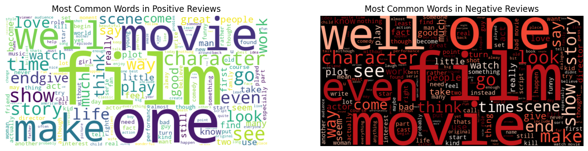

## Movie Sentiment Analysis

### Background

Sentiment Analysis is a technique used in natural language processing to identify and extract sentiments or opinions expressed in text data. The primary objective is to comprehend the sentiment enclosed in text whether positive, negative or neutral. One approach to classify sentiments is to use supervised learning algorithms and deep learning neural networks.

Movie reviews are often used to gauge the performance of a movie, and are often a source of insight for movie studios and potential viewers to understand the movie’s strong or weak points. Applying sentiment analysis on movies reviews can help better understand viewer’s attitude towards the film.

### Data Exploration


```python
import pandas as pd
from bs4 import BeautifulSoup, MarkupResemblesLocatorWarning
import warnings
import nltk
from nltk.corpus import stopwords, wordnet
from nltk.tokenize import word_tokenize
from nltk.stem import WordNetLemmatizer
import seaborn as sns
import matplotlib.pyplot as plt

nltk.download("averaged_perceptron_tagger", quiet=True)
nltk.download("wordnet", quiet=True)
nltk.download("punkt", quiet=True)
nltk.download("punkt_tab", quiet=True)
nltk.download("stopwords", quiet=True)
nltk.download("averaged_perceptron_tagger_eng", quiet=True)
warnings.filterwarnings("ignore", category=MarkupResemblesLocatorWarning)
```


```python
reviews = pd.read_csv("IMDB Dataset.csv")
reviews.head()
```


  <div id="df-5b89e6d3-e807-437a-9873-b873951ccf4a" class="colab-df-container">
    <div>
<style scoped>
    .dataframe tbody tr th:only-of-type {
        vertical-align: middle;
    }

    .dataframe tbody tr th {
        vertical-align: top;
    }

    .dataframe thead th {
        text-align: right;
    }
</style>
<table border="1" class="dataframe">
  <thead>
    <tr style="text-align: right;">
      <th></th>
      <th>review</th>
      <th>sentiment</th>
    </tr>
  </thead>
  <tbody>
    <tr>
      <th>0</th>
      <td>One of the other reviewers has mentioned that ...</td>
      <td>positive</td>
    </tr>
    <tr>
      <th>1</th>
      <td>A wonderful little production. &lt;br /&gt;&lt;br /&gt;The...</td>
      <td>positive</td>
    </tr>
    <tr>
      <th>2</th>
      <td>I thought this was a wonderful way to spend ti...</td>
      <td>positive</td>
    </tr>
    <tr>
      <th>3</th>
      <td>Basically there's a family where a little boy ...</td>
      <td>negative</td>
    </tr>
    <tr>
      <th>4</th>
      <td>Petter Mattei's "Love in the Time of Money" is...</td>
      <td>positive</td>
    </tr>
  </tbody>
</table>
</div>
    <div class="colab-df-buttons">

  <div class="colab-df-container">
    <button class="colab-df-convert" onclick="convertToInteractive('df-5b89e6d3-e807-437a-9873-b873951ccf4a')"
            title="Convert this dataframe to an interactive table."
            style="display:none;">

  <svg xmlns="http://www.w3.org/2000/svg" height="24px" viewBox="0 -960 960 960">
    <path d="M120-120v-720h720v720H120Zm60-500h600v-160H180v160Zm220 220h160v-160H400v160Zm0 220h160v-160H400v160ZM180-400h160v-160H180v160Zm440 0h160v-160H620v160ZM180-180h160v-160H180v160Zm440 0h160v-160H620v160Z"/>
  </svg>
    </button>

  <style>
    .colab-df-container {
      display:flex;
      gap: 12px;
    }

    .colab-df-convert {
      background-color: #E8F0FE;
      border: none;
      border-radius: 50%;
      cursor: pointer;
      display: none;
      fill: #1967D2;
      height: 32px;
      padding: 0 0 0 0;
      width: 32px;
    }

    .colab-df-convert:hover {
      background-color: #E2EBFA;
      box-shadow: 0px 1px 2px rgba(60, 64, 67, 0.3), 0px 1px 3px 1px rgba(60, 64, 67, 0.15);
      fill: #174EA6;
    }

    .colab-df-buttons div {
      margin-bottom: 4px;
    }

    [theme=dark] .colab-df-convert {
      background-color: #3B4455;
      fill: #D2E3FC;
    }

    [theme=dark] .colab-df-convert:hover {
      background-color: #434B5C;
      box-shadow: 0px 1px 3px 1px rgba(0, 0, 0, 0.15);
      filter: drop-shadow(0px 1px 2px rgba(0, 0, 0, 0.3));
      fill: #FFFFFF;
    }
  </style>

    <script>
      const buttonEl =
        document.querySelector('#df-5b89e6d3-e807-437a-9873-b873951ccf4a button.colab-df-convert');
      buttonEl.style.display =
        google.colab.kernel.accessAllowed ? 'block' : 'none';

      async function convertToInteractive(key) {
        const element = document.querySelector('#df-5b89e6d3-e807-437a-9873-b873951ccf4a');
        const dataTable =
          await google.colab.kernel.invokeFunction('convertToInteractive',
                                                    [key], {});
        if (!dataTable) return;

        const docLinkHtml = 'Like what you see? Visit the ' +
          '<a target="_blank" href=https://colab.research.google.com/notebooks/data_table.ipynb>data table notebook</a>'
          + ' to learn more about interactive tables.';
        element.innerHTML = '';
        dataTable['output_type'] = 'display_data';
        await google.colab.output.renderOutput(dataTable, element);
        const docLink = document.createElement('div');
        docLink.innerHTML = docLinkHtml;
        element.appendChild(docLink);
      }
    </script>
  </div>


    <div id="df-8b0de078-b7d1-46e3-9f2e-1b5782fc1213">
      <button class="colab-df-quickchart" onclick="quickchart('df-8b0de078-b7d1-46e3-9f2e-1b5782fc1213')"
                title="Suggest charts"
                style="display:none;">

<svg xmlns="http://www.w3.org/2000/svg" height="24px"viewBox="0 0 24 24"
     width="24px">
    <g>
        <path d="M19 3H5c-1.1 0-2 .9-2 2v14c0 1.1.9 2 2 2h14c1.1 0 2-.9 2-2V5c0-1.1-.9-2-2-2zM9 17H7v-7h2v7zm4 0h-2V7h2v10zm4 0h-2v-4h2v4z"/>
    </g>
</svg>
      </button>

<style>
  .colab-df-quickchart {
      --bg-color: #E8F0FE;
      --fill-color: #1967D2;
      --hover-bg-color: #E2EBFA;
      --hover-fill-color: #174EA6;
      --disabled-fill-color: #AAA;
      --disabled-bg-color: #DDD;
  }

  [theme=dark] .colab-df-quickchart {
      --bg-color: #3B4455;
      --fill-color: #D2E3FC;
      --hover-bg-color: #434B5C;
      --hover-fill-color: #FFFFFF;
      --disabled-bg-color: #3B4455;
      --disabled-fill-color: #666;
  }

  .colab-df-quickchart {
    background-color: var(--bg-color);
    border: none;
    border-radius: 50%;
    cursor: pointer;
    display: none;
    fill: var(--fill-color);
    height: 32px;
    padding: 0;
    width: 32px;
  }

  .colab-df-quickchart:hover {
    background-color: var(--hover-bg-color);
    box-shadow: 0 1px 2px rgba(60, 64, 67, 0.3), 0 1px 3px 1px rgba(60, 64, 67, 0.15);
    fill: var(--button-hover-fill-color);
  }

  .colab-df-quickchart-complete:disabled,
  .colab-df-quickchart-complete:disabled:hover {
    background-color: var(--disabled-bg-color);
    fill: var(--disabled-fill-color);
    box-shadow: none;
  }

  .colab-df-spinner {
    border: 2px solid var(--fill-color);
    border-color: transparent;
    border-bottom-color: var(--fill-color);
    animation:
      spin 1s steps(1) infinite;
  }

  @keyframes spin {
    0% {
      border-color: transparent;
      border-bottom-color: var(--fill-color);
      border-left-color: var(--fill-color);
    }
    20% {
      border-color: transparent;
      border-left-color: var(--fill-color);
      border-top-color: var(--fill-color);
    }
    30% {
      border-color: transparent;
      border-left-color: var(--fill-color);
      border-top-color: var(--fill-color);
      border-right-color: var(--fill-color);
    }
    40% {
      border-color: transparent;
      border-right-color: var(--fill-color);
      border-top-color: var(--fill-color);
    }
    60% {
      border-color: transparent;
      border-right-color: var(--fill-color);
    }
    80% {
      border-color: transparent;
      border-right-color: var(--fill-color);
      border-bottom-color: var(--fill-color);
    }
    90% {
      border-color: transparent;
      border-bottom-color: var(--fill-color);
    }
  }
</style>

      <script>
        async function quickchart(key) {
          const quickchartButtonEl =
            document.querySelector('#' + key + ' button');
          quickchartButtonEl.disabled = true;  // To prevent multiple clicks.
          quickchartButtonEl.classList.add('colab-df-spinner');
          try {
            const charts = await google.colab.kernel.invokeFunction(
                'suggestCharts', [key], {});
          } catch (error) {
            console.error('Error during call to suggestCharts:', error);
          }
          quickchartButtonEl.classList.remove('colab-df-spinner');
          quickchartButtonEl.classList.add('colab-df-quickchart-complete');
        }
        (() => {
          let quickchartButtonEl =
            document.querySelector('#df-8b0de078-b7d1-46e3-9f2e-1b5782fc1213 button');
          quickchartButtonEl.style.display =
            google.colab.kernel.accessAllowed ? 'block' : 'none';
        })();
      </script>
    </div>

    </div>
  </div>


```python
reviews.info()
```

    <class 'pandas.core.frame.DataFrame'>
    RangeIndex: 50000 entries, 0 to 49999
    Data columns (total 2 columns):
     #   Column     Non-Null Count  Dtype 
    ---  ------     --------------  ----- 
     0   review     50000 non-null  object
     1   sentiment  50000 non-null  object
    dtypes: object(2)
    memory usage: 781.4+ KB


```python
reviews.nunique()
```


<div>
<style scoped>
    .dataframe tbody tr th:only-of-type {
        vertical-align: middle;
    }

    .dataframe tbody tr th {
        vertical-align: top;
    }

    .dataframe thead th {
        text-align: right;
    }
</style>
<table border="1" class="dataframe">
  <thead>
    <tr style="text-align: right;">
      <th></th>
      <th>0</th>
    </tr>
  </thead>
  <tbody>
    <tr>
      <th>review</th>
      <td>49582</td>
    </tr>
    <tr>
      <th>sentiment</th>
      <td>2</td>
    </tr>
  </tbody>
</table>
</div><br><label><b>dtype:</b> int64</label>


Previewing our data, we can see that a majority of the 50,000 reviews are unique, which makes sense as each review are unique strings of long text. Our reviews are split into 2 categories: positive or negative.


```python
reviews.isna().sum()
```


<div>
<style scoped>
    .dataframe tbody tr th:only-of-type {
        vertical-align: middle;
    }

    .dataframe tbody tr th {
        vertical-align: top;
    }

    .dataframe thead th {
        text-align: right;
    }
</style>
<table border="1" class="dataframe">
  <thead>
    <tr style="text-align: right;">
      <th></th>
      <th>0</th>
    </tr>
  </thead>
  <tbody>
    <tr>
      <th>review</th>
      <td>0</td>
    </tr>
    <tr>
      <th>sentiment</th>
      <td>0</td>
    </tr>
  </tbody>
</table>
</div><br><label><b>dtype:</b> int64</label>


### Text Cleaning


```python
reviews["review"][0]
```


    "One of the other reviewers has mentioned that after watching just 1 Oz episode you'll be hooked. They are right, as this is exactly what happened with me.<br /><br />The first thing that struck me about Oz was its brutality and unflinching scenes of violence, which set in right from the word GO. Trust me, this is not a show for the faint hearted or timid. This show pulls no punches with regards to drugs, sex or violence. Its is hardcore, in the classic use of the word.<br /><br />It is called OZ as that is the nickname given to the Oswald Maximum Security State Penitentary. It focuses mainly on Emerald City, an experimental section of the prison where all the cells have glass fronts and face inwards, so privacy is not high on the agenda. Em City is home to many..Aryans, Muslims, gangstas, Latinos, Christians, Italians, Irish and more....so scuffles, death stares, dodgy dealings and shady agreements are never far away.<br /><br />I would say the main appeal of the show is due to the fact that it goes where other shows wouldn't dare. Forget pretty pictures painted for mainstream audiences, forget charm, forget romance...OZ doesn't mess around. The first episode I ever saw struck me as so nasty it was surreal, I couldn't say I was ready for it, but as I watched more, I developed a taste for Oz, and got accustomed to the high levels of graphic violence. Not just violence, but injustice (crooked guards who'll be sold out for a nickel, inmates who'll kill on order and get away with it, well mannered, middle class inmates being turned into prison bitches due to their lack of street skills or prison experience) Watching Oz, you may become comfortable with what is uncomfortable viewing....thats if you can get in touch with your darker side."


Some issues we can see from the text are:
- Casing inconsistency
- Punctuation
- HTML Tags

These will need to be removed to help feed our later models better data.

#### Applying Lowercase


```python
reviews["review"] = reviews["review"].apply(lambda x: x.lower() if isinstance(x, str) else x)
reviews["review"][0]
```


    "one of the other reviewers has mentioned that after watching just 1 oz episode you'll be hooked. they are right, as this is exactly what happened with me.<br /><br />the first thing that struck me about oz was its brutality and unflinching scenes of violence, which set in right from the word go. trust me, this is not a show for the faint hearted or timid. this show pulls no punches with regards to drugs, sex or violence. its is hardcore, in the classic use of the word.<br /><br />it is called oz as that is the nickname given to the oswald maximum security state penitentary. it focuses mainly on emerald city, an experimental section of the prison where all the cells have glass fronts and face inwards, so privacy is not high on the agenda. em city is home to many..aryans, muslims, gangstas, latinos, christians, italians, irish and more....so scuffles, death stares, dodgy dealings and shady agreements are never far away.<br /><br />i would say the main appeal of the show is due to the fact that it goes where other shows wouldn't dare. forget pretty pictures painted for mainstream audiences, forget charm, forget romance...oz doesn't mess around. the first episode i ever saw struck me as so nasty it was surreal, i couldn't say i was ready for it, but as i watched more, i developed a taste for oz, and got accustomed to the high levels of graphic violence. not just violence, but injustice (crooked guards who'll be sold out for a nickel, inmates who'll kill on order and get away with it, well mannered, middle class inmates being turned into prison bitches due to their lack of street skills or prison experience) watching oz, you may become comfortable with what is uncomfortable viewing....thats if you can get in touch with your darker side."


#### Removing HTML Tags


```python
reviews["review"] = reviews["review"].apply(lambda x: BeautifulSoup(str(x), "html.parser").get_text())
reviews["review"][0]
```


    "one of the other reviewers has mentioned that after watching just 1 oz episode you'll be hooked. they are right, as this is exactly what happened with me.the first thing that struck me about oz was its brutality and unflinching scenes of violence, which set in right from the word go. trust me, this is not a show for the faint hearted or timid. this show pulls no punches with regards to drugs, sex or violence. its is hardcore, in the classic use of the word.it is called oz as that is the nickname given to the oswald maximum security state penitentary. it focuses mainly on emerald city, an experimental section of the prison where all the cells have glass fronts and face inwards, so privacy is not high on the agenda. em city is home to many..aryans, muslims, gangstas, latinos, christians, italians, irish and more....so scuffles, death stares, dodgy dealings and shady agreements are never far away.i would say the main appeal of the show is due to the fact that it goes where other shows wouldn't dare. forget pretty pictures painted for mainstream audiences, forget charm, forget romance...oz doesn't mess around. the first episode i ever saw struck me as so nasty it was surreal, i couldn't say i was ready for it, but as i watched more, i developed a taste for oz, and got accustomed to the high levels of graphic violence. not just violence, but injustice (crooked guards who'll be sold out for a nickel, inmates who'll kill on order and get away with it, well mannered, middle class inmates being turned into prison bitches due to their lack of street skills or prison experience) watching oz, you may become comfortable with what is uncomfortable viewing....thats if you can get in touch with your darker side."


#### Punctuation and Non-Words


```python
reviews["review"] = reviews["review"].replace(to_replace=r"[^\w\s]", value="", regex=True)
reviews["review"][0]
```


    'one of the other reviewers has mentioned that after watching just 1 oz episode youll be hooked they are right as this is exactly what happened with methe first thing that struck me about oz was its brutality and unflinching scenes of violence which set in right from the word go trust me this is not a show for the faint hearted or timid this show pulls no punches with regards to drugs sex or violence its is hardcore in the classic use of the wordit is called oz as that is the nickname given to the oswald maximum security state penitentary it focuses mainly on emerald city an experimental section of the prison where all the cells have glass fronts and face inwards so privacy is not high on the agenda em city is home to manyaryans muslims gangstas latinos christians italians irish and moreso scuffles death stares dodgy dealings and shady agreements are never far awayi would say the main appeal of the show is due to the fact that it goes where other shows wouldnt dare forget pretty pictures painted for mainstream audiences forget charm forget romanceoz doesnt mess around the first episode i ever saw struck me as so nasty it was surreal i couldnt say i was ready for it but as i watched more i developed a taste for oz and got accustomed to the high levels of graphic violence not just violence but injustice crooked guards wholl be sold out for a nickel inmates wholl kill on order and get away with it well mannered middle class inmates being turned into prison bitches due to their lack of street skills or prison experience watching oz you may become comfortable with what is uncomfortable viewingthats if you can get in touch with your darker side'


#### Removing Digits


```python
reviews["review"] = reviews["review"].replace(to_replace=r"\d", value="", regex=True)
reviews["review"][0]
```


    'one of the other reviewers has mentioned that after watching just  oz episode youll be hooked they are right as this is exactly what happened with methe first thing that struck me about oz was its brutality and unflinching scenes of violence which set in right from the word go trust me this is not a show for the faint hearted or timid this show pulls no punches with regards to drugs sex or violence its is hardcore in the classic use of the wordit is called oz as that is the nickname given to the oswald maximum security state penitentary it focuses mainly on emerald city an experimental section of the prison where all the cells have glass fronts and face inwards so privacy is not high on the agenda em city is home to manyaryans muslims gangstas latinos christians italians irish and moreso scuffles death stares dodgy dealings and shady agreements are never far awayi would say the main appeal of the show is due to the fact that it goes where other shows wouldnt dare forget pretty pictures painted for mainstream audiences forget charm forget romanceoz doesnt mess around the first episode i ever saw struck me as so nasty it was surreal i couldnt say i was ready for it but as i watched more i developed a taste for oz and got accustomed to the high levels of graphic violence not just violence but injustice crooked guards wholl be sold out for a nickel inmates wholl kill on order and get away with it well mannered middle class inmates being turned into prison bitches due to their lack of street skills or prison experience watching oz you may become comfortable with what is uncomfortable viewingthats if you can get in touch with your darker side'


#### Tokenization


```python
reviews["review"] = reviews["review"].apply(word_tokenize)
```

#### Stop Word Removal

There are some words in our corpus that are very common and have little to no value when evaluating sentiment. Words such as "and", "is", "the", etc., only add bloat to our model and thus, will be removed.


```python
stop_words = set(stopwords.words("english"))
reviews["review"] = reviews["review"].apply(lambda x: [word for word in x if word not in stop_words])
```

#### Lemmatization

Lemmatization is a powerful concept because it reduces words to their base form. Words such as "running", "runs" and "ran", will be four different features, however, if we reduce them to their base form "run", we can decrease the size of our vocabulary and allows for better pattern recognition between words.


```python
lemmatizer = WordNetLemmatizer()

def lemmatize_tokens(tokens):
    def get_wordnet_pos(word):
        tag = nltk.pos_tag([word])[0][1][0].upper()
        tag_dict = {
            "J": wordnet.ADJ,
            "N": wordnet.NOUN,
            "V": wordnet.VERB,
            "R": wordnet.ADV
        }
        return tag_dict.get(tag, wordnet.NOUN)
    lemmas = [lemmatizer.lemmatize(token, get_wordnet_pos(token)) for token in tokens]
    return lemmas
reviews["review"] = reviews["review"].apply(lemmatize_tokens)
```

### Exploratory Data Analysis


```python
print(pd.DataFrame(results))
```

               Logistic  Decision Tree  Gradient Boosted  Random Forest  Bagging  \
    Precision     0.683          0.630             0.709          0.701    0.682   
    Accuracy      0.820          0.791             0.808          0.815    0.803   
    Recall        0.595          0.512             0.464          0.528    0.483   
    ROC AUC       0.748          0.702             0.698          0.724    0.701   
    
                 SVM  Neural Network  
    Precision  0.688           0.644  
    Accuracy   0.820           0.803  
    Recall     0.590           0.571  
    ROC AUC    0.747           0.729  


```python
reviews["review_length"] = reviews["review"].apply(lambda x: len(x))

plt.figure(figsize=(12, 6))
sns.kdeplot(
    data=reviews,
    x="review_length",
    hue="sentiment",
    fill=True,
    common_norm=False,
    alpha=0.5,
    palette={"positive": "green", "negative": "red"}
)

plt.xlabel("Review Length", fontsize=12)
plt.ylabel("Density", fontsize=12)
plt.title("Distribution of Review Lengths by Sentiment", fontsize=14)
plt.xticks(fontsize=10)
plt.yticks(fontsize=10)
plt.legend(title="Sentiment")
plt.tight_layout()
plt.show()
```

    <ipython-input-18-e4eaef7c9696>:19: UserWarning: No artists with labels found to put in legend.  Note that artists whose label start with an underscore are ignored when legend() is called with no argument.
      plt.legend(title="Sentiment")


    

    


Both the negative and positive reviews, on average, have similar lengths. The average review length after text cleaning is around 100 words, with some reviews on the higher and lower ends.


```python
from wordcloud import WordCloud

positive_reviews = reviews[reviews["sentiment"] == "positive"]["review"].explode().tolist()
negative_reviews = reviews[reviews["sentiment"] == "negative"]["review"].explode().tolist()

pos_text = " ".join(positive_reviews)
neg_text = " ".join(negative_reviews)

wordcloud_pos = WordCloud(width=800, height=400, background_color='white').generate(pos_text)
wordcloud_neg = WordCloud(width=800, height=400, background_color='black', colormap='Reds').generate(neg_text)

plt.figure(figsize=(15, 6))
plt.subplot(1, 2, 1)
plt.imshow(wordcloud_pos, interpolation='bilinear')
plt.title("Most Common Words in Positive Reviews")
plt.axis('off')

plt.subplot(1, 2, 2)
plt.imshow(wordcloud_neg, interpolation='bilinear')
plt.title("Most Common Words in Negative Reviews")
plt.axis('off')
plt.show()
```


    

    


There are a lot of common word overlap between the positive and negative reviews, words such as "well", "film", "character" and "show" appear often in both. We can notice that words with negative and positive sentiment appearing in their respective visualizations, i.e. "bad" appearing in the negative data and "love" appearing in the positive data.

### Embeddings


```python
from sklearn.feature_extraction.text import CountVectorizer, TfidfVectorizer
from sklearn.model_selection import train_test_split, GridSearchCV, KFold
from sklearn.preprocessing import LabelEncoder
from sklearn.naive_bayes import MultinomialNB
from sklearn.linear_model import LogisticRegression, SGDClassifier
from xgboost import XGBClassifier
from sklearn.svm import LinearSVC
from sklearn.pipeline import Pipeline
from sklearn.metrics import recall_score, roc_auc_score, accuracy_score, precision_score, make_scorer
```


```python
X = reviews["review"].apply(lambda x: " ".join(x))
y = reviews["sentiment"]

X_train, X_test, y_train, y_test = train_test_split(X, y, test_size=0.2, random_state=42)
encoder = LabelEncoder()
y_train = encoder.fit_transform(y_train)
y_test = encoder.transform(y_test)
```

#### Bag of Words


```python
folds = KFold(n_splits=5, shuffle=True, random_state=42)
bow_settings = {
	"Bag of Words - 20K Words": {'max_features': 20000, 'ngram_range': (1, 1)},
    "Bag of Words - 50K Words Update": {'max_features': 50000, 'ngram_range': (1, 1)},
    "Bag of Words - Bigram Update": {'max_features': 50000, 'ngram_range': (2, 2)},
    "Bag of Words - Mixed Unigram and Bigram Update": {'max_features': 50000, 'ngram_range': (1, 2)},
}

models = {
	"Naive Bayes": (MultinomialNB(), {
		"alpha": [0.1, 0.01, 1]
	}),
	"Logistic Regression": (LogisticRegression(), {
		"C": [0.01, 0.1, 1],
		"penalty": ["l2"],
        "solver": ["liblinear"]
	}),
	"SGD Classifier": (SGDClassifier(), {
		"loss": ["log_loss", "hinge"],
		"penalty": ["l2", "l1"],
		"alpha": [1e-4, 1e-3, 1e-2],
	}),
	"Linear SVC": (LinearSVC(dual=False, max_iter=5000), {
		"C": [0.01, 0.1, 1],
        "loss": ["squared_hinge"],
        "penalty": ["l2"]
	}),
	"XGBoosted Trees": (XGBClassifier(), {
        "learning_rate": [0.1, 0.3]
	})
}

results = []
for desc, vec_params in bow_settings.items():
    print(f"Processing {desc}...")
    vectorizer = CountVectorizer(**vec_params)
    X_train_vec = vectorizer.fit_transform(X_train)
    X_test_vec = vectorizer.transform(X_test)
    for model_name, details in models.items():
        print(f"    Tuning {model_name}...")
        classifier, grid_params = details
        grid = GridSearchCV(
          estimator=classifier,
          param_grid=grid_params,
          cv=folds,
          scoring="accuracy",
          n_jobs=-1
        )
        grid.fit(X_train_vec, y_train)
        best_model = grid.best_estimator_
        y_pred = best_model.predict(X_test_vec)
        accuracy = accuracy_score(y_test, y_pred)

        results.append({
            "Model": model_name,
            "Vectorizer": desc,
            "CV Accuracy": round(grid.best_score_, 3),
            "Test Accuracy": round(accuracy, 3),
            "Best Params": grid.best_params_
        })

```

    Processing Bag of Words - 20K Words...
        Tuning Naive Bayes...
        Tuning Logistic Regression...
        Tuning SGD Classifier...
        Tuning Linear SVC...
        Tuning XGBoosted Trees...
    Processing Bag of Words - 50K Words Update...
        Tuning Naive Bayes...
        Tuning Logistic Regression...


    /usr/local/lib/python3.11/dist-packages/joblib/externals/loky/process_executor.py:752: UserWarning: A worker stopped while some jobs were given to the executor. This can be caused by a too short worker timeout or by a memory leak.
      warnings.warn(


        Tuning SGD Classifier...
        Tuning Linear SVC...
        Tuning XGBoosted Trees...
    Processing Bag of Words - Bigram Update...
        Tuning Naive Bayes...
        Tuning Logistic Regression...
        Tuning SGD Classifier...
        Tuning Linear SVC...
        Tuning XGBoosted Trees...
    Processing Bag of Words - Mixed Unigram and Bigram Update...
        Tuning Naive Bayes...
        Tuning Logistic Regression...
        Tuning SGD Classifier...
        Tuning Linear SVC...
        Tuning XGBoosted Trees...


    /usr/local/lib/python3.11/dist-packages/joblib/externals/loky/process_executor.py:752: UserWarning: A worker stopped while some jobs were given to the executor. This can be caused by a too short worker timeout or by a memory leak.
      warnings.warn(


```python
bow_table = pd.DataFrame(results)
print("\n=== Summary Table ===")
print(bow_table)
```

    
    === Summary Table ===
                      Model                                      Vectorizer  \
    0           Naive Bayes                        Bag of Words - 20K Words   
    1   Logistic Regression                        Bag of Words - 20K Words   
    2        SGD Classifier                        Bag of Words - 20K Words   
    3            Linear SVC                        Bag of Words - 20K Words   
    4       XGBoosted Trees                        Bag of Words - 20K Words   
    5           Naive Bayes                 Bag of Words - 50K Words Update   
    6   Logistic Regression                 Bag of Words - 50K Words Update   
    7        SGD Classifier                 Bag of Words - 50K Words Update   
    8            Linear SVC                 Bag of Words - 50K Words Update   
    9       XGBoosted Trees                 Bag of Words - 50K Words Update   
    10          Naive Bayes                    Bag of Words - Bigram Update   
    11  Logistic Regression                    Bag of Words - Bigram Update   
    12       SGD Classifier                    Bag of Words - Bigram Update   
    13           Linear SVC                    Bag of Words - Bigram Update   
    14      XGBoosted Trees                    Bag of Words - Bigram Update   
    15          Naive Bayes  Bag of Words - Mixed Unigram and Bigram Update   
    16  Logistic Regression  Bag of Words - Mixed Unigram and Bigram Update   
    17       SGD Classifier  Bag of Words - Mixed Unigram and Bigram Update   
    18           Linear SVC  Bag of Words - Mixed Unigram and Bigram Update   
    19      XGBoosted Trees  Bag of Words - Mixed Unigram and Bigram Update   
    
        CV Accuracy  Test Accuracy  \
    0         0.850          0.851   
    1         0.886          0.887   
    2         0.885          0.885   
    3         0.885          0.886   
    4         0.848          0.859   
    5         0.852          0.853   
    6         0.887          0.888   
    7         0.885          0.888   
    8         0.886          0.888   
    9         0.848          0.859   
    10        0.864          0.869   
    11        0.850          0.861   
    12        0.849          0.859   
    13        0.851          0.860   
    14        0.766          0.770   
    15        0.870          0.871   
    16        0.894          0.898   
    17        0.892          0.892   
    18        0.894          0.900   
    19        0.853          0.858   
    
                                              Best Params  
    0                                        {'alpha': 1}  
    1   {'C': 0.1, 'penalty': 'l2', 'solver': 'libline...  
    2   {'alpha': 0.001, 'loss': 'log_loss', 'penalty'...  
    3   {'C': 0.01, 'loss': 'squared_hinge', 'penalty'...  
    4                              {'learning_rate': 0.3}  
    5                                        {'alpha': 1}  
    6   {'C': 0.1, 'penalty': 'l2', 'solver': 'libline...  
    7   {'alpha': 0.001, 'loss': 'hinge', 'penalty': '...  
    8   {'C': 0.01, 'loss': 'squared_hinge', 'penalty'...  
    9                              {'learning_rate': 0.3}  
    10                                       {'alpha': 1}  
    11  {'C': 0.1, 'penalty': 'l2', 'solver': 'libline...  
    12  {'alpha': 0.0001, 'loss': 'log_loss', 'penalty...  
    13  {'C': 0.01, 'loss': 'squared_hinge', 'penalty'...  
    14                             {'learning_rate': 0.3}  
    15                                     {'alpha': 0.1}  
    16  {'C': 0.1, 'penalty': 'l2', 'solver': 'libline...  
    17  {'alpha': 0.001, 'loss': 'log_loss', 'penalty'...  
    18  {'C': 0.01, 'loss': 'squared_hinge', 'penalty'...  
    19                             {'learning_rate': 0.3}  


#### TF-IDF


```python
folds = KFold(n_splits=5, shuffle=True, random_state=42)
tfidf_settings = {
  "TF-IDF - 20K Words": {
    "max_features": 20000,
    "ngram_range": (1, 1),
  },
  "TF-IDF - 50K Words Update": {
    "max_features": 100000,
    "ngram_range": (1, 1),
  },
  "TF-IDF - Bigram Update": {
    "max_features": 50000,
    "ngram_range": (2, 2),
    "min_df": 1
  },
  "TF-IDF - Mixed Unigram and Bigram Update": {
    "max_features": 50000,
    "ngram_range": (1, 2),
  }
}

models = {
	"Naive Bayes": (MultinomialNB(), {
		"alpha": [0.1, 0.01, 1]
	}),
	"Logistic Regression": (LogisticRegression(), {
		"C": [0.01, 0.1, 1],
		"penalty": ["l2"],
    "solver": ["liblinear"]
	}),
	"SGD Classifier": (SGDClassifier(), {
		"loss": ["log_loss", "hinge"],
		"penalty": ["l2", "l1"],
		"alpha": [1e-4, 1e-3, 1e-2],
	}),
	"Linear SVC": (LinearSVC(dual=False, max_iter=5000), {
		"C": [0.01, 0.1, 1],
        "loss": ["squared_hinge"],
        "penalty": ["l2"]
	}),
	"XGBoosted Trees": (XGBClassifier(), {
        "learning_rate": [0.1, 0.3]
	})
}

results = []
for desc, vec_params in tfidf_settings.items():
    print(f"Processing {desc}...")
    vectorizer = TfidfVectorizer(**vec_params)
    X_train_vec = vectorizer.fit_transform(X_train)
    X_test_vec = vectorizer.transform(X_test)
    for model_name, details in models.items():
        print(f"  Tuning {model_name}...")
        classifier, grid_params = details
        grid = GridSearchCV(
          estimator=classifier,
          param_grid=grid_params,
          cv=folds,
          scoring="accuracy",
          n_jobs=-1
        )
        grid.fit(X_train_vec, y_train)
        best_model = grid.best_estimator_
        y_pred = best_model.predict(X_test_vec)
        accuracy = accuracy_score(y_test, y_pred)

        results.append({
            "Model": model_name,
            "Vectorizer": desc,
            "CV Accuracy": round(grid.best_score_, 3),
            "Test Accuracy": round(accuracy, 3),
            "Best Params": grid.best_params_
        })
```

    Processing TF-IDF - 20K Words...
      Tuning Naive Bayes...
      Tuning Logistic Regression...
      Tuning SGD Classifier...
      Tuning Linear SVC...
      Tuning XGBoosted Trees...
    Processing TF-IDF - 50K Words Update...
      Tuning Naive Bayes...
      Tuning Logistic Regression...
      Tuning SGD Classifier...
      Tuning Linear SVC...
      Tuning XGBoosted Trees...
    Processing TF-IDF - Bigram Update...
      Tuning Naive Bayes...
      Tuning Logistic Regression...
      Tuning SGD Classifier...
      Tuning Linear SVC...
      Tuning XGBoosted Trees...
    Processing TF-IDF - Mixed Unigram and Bigram Update...
      Tuning Naive Bayes...
      Tuning Logistic Regression...
      Tuning SGD Classifier...
      Tuning Linear SVC...
      Tuning XGBoosted Trees...


```python
tfidf_table = pd.DataFrame(results)
print("\n=== Summary Table ===")
print(tfidf_table)
```

    
    === Summary Table ===
                      Model                                Vectorizer  \
    0           Naive Bayes                        TF-IDF - 20K Words   
    1   Logistic Regression                        TF-IDF - 20K Words   
    2        SGD Classifier                        TF-IDF - 20K Words   
    3            Linear SVC                        TF-IDF - 20K Words   
    4       XGBoosted Trees                        TF-IDF - 20K Words   
    5           Naive Bayes                 TF-IDF - 50K Words Update   
    6   Logistic Regression                 TF-IDF - 50K Words Update   
    7        SGD Classifier                 TF-IDF - 50K Words Update   
    8            Linear SVC                 TF-IDF - 50K Words Update   
    9       XGBoosted Trees                 TF-IDF - 50K Words Update   
    10          Naive Bayes                    TF-IDF - Bigram Update   
    11  Logistic Regression                    TF-IDF - Bigram Update   
    12       SGD Classifier                    TF-IDF - Bigram Update   
    13           Linear SVC                    TF-IDF - Bigram Update   
    14      XGBoosted Trees                    TF-IDF - Bigram Update   
    15          Naive Bayes  TF-IDF - Mixed Unigram and Bigram Update   
    16  Logistic Regression  TF-IDF - Mixed Unigram and Bigram Update   
    17       SGD Classifier  TF-IDF - Mixed Unigram and Bigram Update   
    18           Linear SVC  TF-IDF - Mixed Unigram and Bigram Update   
    19      XGBoosted Trees  TF-IDF - Mixed Unigram and Bigram Update   
    
        CV Accuracy  Test Accuracy  \
    0         0.856          0.858   
    1         0.888          0.890   
    2         0.888          0.889   
    3         0.889          0.891   
    4         0.850          0.855   
    5         0.858          0.862   
    6         0.888          0.891   
    7         0.888          0.889   
    8         0.890          0.891   
    9         0.850          0.852   
    10        0.868          0.871   
    11        0.856          0.866   
    12        0.853          0.862   
    13        0.855          0.867   
    14        0.763          0.770   
    15        0.878          0.879   
    16        0.894          0.894   
    17        0.895          0.895   
    18        0.898          0.902   
    19        0.853          0.856   
    
                                              Best Params  
    0                                        {'alpha': 1}  
    1    {'C': 1, 'penalty': 'l2', 'solver': 'liblinear'}  
    2   {'alpha': 0.0001, 'loss': 'hinge', 'penalty': ...  
    3   {'C': 0.1, 'loss': 'squared_hinge', 'penalty':...  
    4                              {'learning_rate': 0.3}  
    5                                        {'alpha': 1}  
    6    {'C': 1, 'penalty': 'l2', 'solver': 'liblinear'}  
    7   {'alpha': 0.0001, 'loss': 'hinge', 'penalty': ...  
    8   {'C': 1, 'loss': 'squared_hinge', 'penalty': '...  
    9                              {'learning_rate': 0.3}  
    10                                       {'alpha': 1}  
    11   {'C': 1, 'penalty': 'l2', 'solver': 'liblinear'}  
    12  {'alpha': 0.0001, 'loss': 'hinge', 'penalty': ...  
    13  {'C': 0.1, 'loss': 'squared_hinge', 'penalty':...  
    14                             {'learning_rate': 0.3}  
    15                                       {'alpha': 1}  
    16   {'C': 1, 'penalty': 'l2', 'solver': 'liblinear'}  
    17  {'alpha': 0.0001, 'loss': 'hinge', 'penalty': ...  
    18  {'C': 1, 'loss': 'squared_hinge', 'penalty': '...  
    19                             {'learning_rate': 0.3}  


#### LSTM


```python
import torch
from torch.utils.data import Dataset, DataLoader
import torch.nn as nn
import torch.optim as optim
from collections import Counter
import re

device = torch.device("cuda" if torch.cuda.is_available() else "cpu")
```

##### Preprocessing


```python
def preprocess(text: str):
    text = text.lower()
    text = BeautifulSoup(text, "html.parser").get_text()
    text = re.sub(r"[^\w\s]", "", text)
    text = re.sub(r"\d", "", text)
    tokens = word_tokenize(text)
    stop_words = set(stopwords.words("english"))
    return [word for word in tokens if word not in stop_words]

reviews = pd.read_csv("IMDB Dataset.csv")
reviews["review"] = reviews["review"].apply(preprocess)
reviews["clean_text"] = reviews["review"].apply(lambda x: " ".join(x))
X = reviews["clean_text"]
y = reviews["sentiment"]

encoder = LabelEncoder()
y = encoder.fit_transform(y)

X_train, X_test, y_train, y_test = train_test_split(X, y, test_size=0.2, random_state=42)
```

##### Text Vectorization


```python
all_text = " ".join(X_train.tolist()).split()
word_counts = Counter(all_text)
vocab = {word: i+2 for i, (word, _) in enumerate(word_counts.most_common())}
vocab["<PAD>"] = 0
vocab["<UNK>"] = 1
```


```python
def text_to_sequence(text, vocab, max_len=100):
    tokens = text.split()
    seq = [vocab.get(word, vocab["<UNK>"]) for word in tokens]
    if len(seq) < max_len:
        seq += [vocab["<PAD>"]] * (max_len - len(seq))
    else:
        seq = seq[:max_len]
    return seq

max_len = 100
X_train_seq = [text_to_sequence(text, vocab, max_len) for text in X_train]
X_test_seq = [text_to_sequence(text, vocab, max_len) for text in X_test]
```


```python
class SentimentDataset(Dataset):
    def __init__(self, sequences, labels):
        self.sequences = sequences
        self.labels = labels

    def __len__(self):
        return len(self.sequences)

    def __getitem__(self, idx):
        return torch.tensor(self.sequences[idx]), torch.tensor(self.labels[idx])

train_dataset = SentimentDataset(X_train_seq, y_train)
test_dataset = SentimentDataset(X_test_seq, y_test)

train_loader = DataLoader(train_dataset, batch_size=32, shuffle=True)
test_loader = DataLoader(test_dataset, batch_size=32)
```


```python
class LSTMClassifier(nn.Module):
    def __init__(self, vocab_size, embedding_dim=100, hidden_dim=128, output_dim=2):
        super(LSTMClassifier, self).__init__()
        self.embedding = nn.Embedding(vocab_size, embedding_dim, padding_idx=0)
        self.lstm = nn.LSTM(embedding_dim, hidden_dim, batch_first=True)
        self.fc = nn.Linear(hidden_dim, output_dim)
        self.softmax = nn.LogSoftmax(dim=1)

    def forward(self, x):
        embedded = self.embedding(x)
        _, (hidden, _) = self.lstm(embedded)
        out = self.fc(hidden[-1])
        return self.softmax(out)

model = LSTMClassifier(vocab_size=len(vocab), output_dim=len(set(y)))
model = model.to(device)
loss_fn = nn.NLLLoss()
optimizer = optim.Adam(model.parameters(), lr=0.001)
```


```python
num_epochs = 20
for epoch in range(num_epochs):
    model.train()
    total_loss = 0
    for inputs, labels in train_loader:
        inputs = inputs.to(device)
        labels = labels.to(device)
        optimizer.zero_grad()
        outputs = model(inputs)
        loss = loss_fn(outputs, labels)
        loss.backward()
        optimizer.step()
        total_loss += loss.item()
    print(f"Epoch {epoch+1}/{num_epochs}, Loss: {total_loss:.3f}")
```

    Epoch 1/20, Loss: 851.410
    Epoch 2/20, Loss: 838.361
    Epoch 3/20, Loss: 636.128
    Epoch 4/20, Loss: 414.108
    Epoch 5/20, Loss: 304.100
    Epoch 6/20, Loss: 205.994
    Epoch 7/20, Loss: 121.233
    Epoch 8/20, Loss: 68.893
    Epoch 9/20, Loss: 41.878
    Epoch 10/20, Loss: 29.095
    Epoch 11/20, Loss: 21.918
    Epoch 12/20, Loss: 16.479
    Epoch 13/20, Loss: 12.161
    Epoch 14/20, Loss: 10.790
    Epoch 15/20, Loss: 11.863
    Epoch 16/20, Loss: 4.792
    Epoch 17/20, Loss: 3.515
    Epoch 18/20, Loss: 6.678
    Epoch 19/20, Loss: 6.306
    Epoch 20/20, Loss: 4.488


```python
model.eval()
correct = 0
total = 0
with torch.no_grad():
    for inputs, labels in test_loader:
        inputs = inputs.to(device)
        labels = labels.to(device)
        outputs = model(inputs)
        _, predicted = torch.max(outputs.data, 1)
        total += labels.size(0)
        correct += (predicted == labels).sum().item()

print(f"Test Accuracy: {correct / total:.3f}")
```

    Test Accuracy: 0.838


### Conclusion

After observing all our models, the one that performs the best is the TF-IDF Linear SVC model with a test accuracy of 90.2%.
