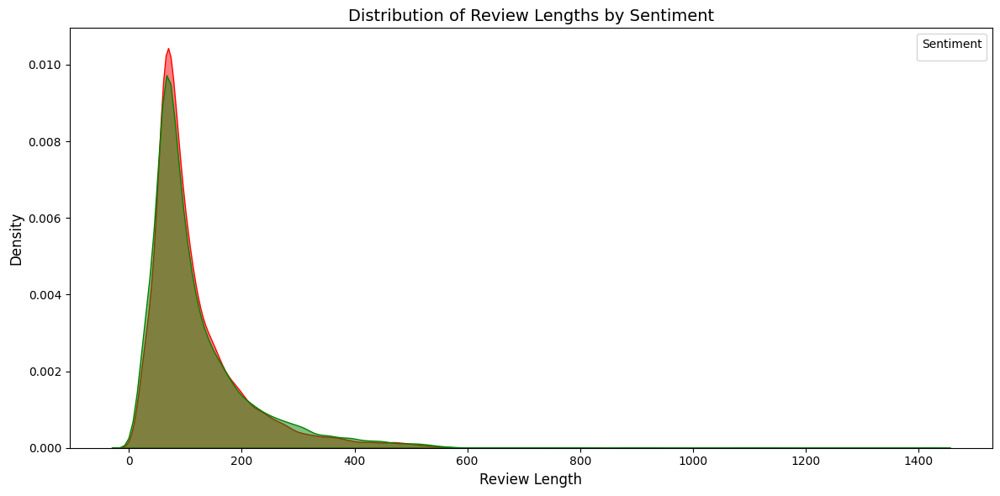
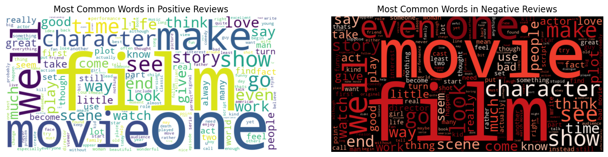

## Movie Sentiment Analysis

### Background

Sentiment Analysis is a technique used in natural language processing to identify and extract sentiments or opinions expressed in text data. The primary objective of sentiment analysis is to comprehend the sentiment enclosed in text, whether positive, negative or neutral. One approach to classify sentiments is to use supervised learning algorithms and deep learning neural networks.

Movie reviews are often used to gauge the performance of a movie, and are often a source of by movie studios and potential viewers to gain insight on the film's strong or weak points. Applying sentiment analysis on movie reviews can help better understand a user's attitude towards the film and, despite their ratings.

### Data Exploration


```python
import pandas as pd
from bs4 import BeautifulSoup, MarkupResemblesLocatorWarning
import warnings
import nltk
from nltk.corpus import stopwords, wordnet
from nltk.tokenize import word_tokenize
from nltk.stem import WordNetLemmatizer
import seaborn as sns
import matplotlib.pyplot as plt

nltk.download("averaged_perceptron_tagger", quiet=True)
nltk.download("wordnet", quiet=True)
nltk.download("punkt", quiet=True)
nltk.download("stopwords", quiet=True)
warnings.filterwarnings("ignore", category=MarkupResemblesLocatorWarning)
```


```python
reviews = pd.read_csv("IMDB Dataset.csv")
reviews.head()
```


<div>
<style scoped>
    .dataframe tbody tr th:only-of-type {
        vertical-align: middle;
    }

    .dataframe tbody tr th {
        vertical-align: top;
    }

    .dataframe thead th {
        text-align: right;
    }
</style>
<table border="1" class="dataframe">
  <thead>
    <tr style="text-align: right;">
      <th></th>
      <th>review</th>
      <th>sentiment</th>
    </tr>
  </thead>
  <tbody>
    <tr>
      <th>0</th>
      <td>One of the other reviewers has mentioned that ...</td>
      <td>positive</td>
    </tr>
    <tr>
      <th>1</th>
      <td>A wonderful little production. &lt;br /&gt;&lt;br /&gt;The...</td>
      <td>positive</td>
    </tr>
    <tr>
      <th>2</th>
      <td>I thought this was a wonderful way to spend ti...</td>
      <td>positive</td>
    </tr>
    <tr>
      <th>3</th>
      <td>Basically there's a family where a little boy ...</td>
      <td>negative</td>
    </tr>
    <tr>
      <th>4</th>
      <td>Petter Mattei's "Love in the Time of Money" is...</td>
      <td>positive</td>
    </tr>
  </tbody>
</table>
</div>


```python
reviews.info()
```

    <class 'pandas.core.frame.DataFrame'>
    RangeIndex: 50000 entries, 0 to 49999
    Data columns (total 2 columns):
     #   Column     Non-Null Count  Dtype 
    ---  ------     --------------  ----- 
     0   review     50000 non-null  object
     1   sentiment  50000 non-null  object
    dtypes: object(2)
    memory usage: 781.4+ KB


```python
reviews.nunique()
```


    review       49582
    sentiment        2
    dtype: int64


Previewing our data, we can see that a majority of the 50,000 reviews are unique, which makes sense as each review are unique strings of long text. Our reviews are split into 2 categories: positive or negative.


```python
reviews.isna().sum()
```


    review       0
    sentiment    0
    dtype: int64


### Text Cleaning


```python
reviews["review"][0]
```


    "One of the other reviewers has mentioned that after watching just 1 Oz episode you'll be hooked. They are right, as this is exactly what happened with me.<br /><br />The first thing that struck me about Oz was its brutality and unflinching scenes of violence, which set in right from the word GO. Trust me, this is not a show for the faint hearted or timid. This show pulls no punches with regards to drugs, sex or violence. Its is hardcore, in the classic use of the word.<br /><br />It is called OZ as that is the nickname given to the Oswald Maximum Security State Penitentary. It focuses mainly on Emerald City, an experimental section of the prison where all the cells have glass fronts and face inwards, so privacy is not high on the agenda. Em City is home to many..Aryans, Muslims, gangstas, Latinos, Christians, Italians, Irish and more....so scuffles, death stares, dodgy dealings and shady agreements are never far away.<br /><br />I would say the main appeal of the show is due to the fact that it goes where other shows wouldn't dare. Forget pretty pictures painted for mainstream audiences, forget charm, forget romance...OZ doesn't mess around. The first episode I ever saw struck me as so nasty it was surreal, I couldn't say I was ready for it, but as I watched more, I developed a taste for Oz, and got accustomed to the high levels of graphic violence. Not just violence, but injustice (crooked guards who'll be sold out for a nickel, inmates who'll kill on order and get away with it, well mannered, middle class inmates being turned into prison bitches due to their lack of street skills or prison experience) Watching Oz, you may become comfortable with what is uncomfortable viewing....thats if you can get in touch with your darker side."


Some issues we can see from the text are:
- Casing inconsistency
- Punctuation
- HTML Tags

These will need to be removed to help feed our later models better data.

#### Applying Lowercase 


```python
reviews["review"] = reviews["review"].apply(lambda x: x.lower() if isinstance(x, str) else x)
reviews["review"][0]
```


    "one of the other reviewers has mentioned that after watching just 1 oz episode you'll be hooked. they are right, as this is exactly what happened with me.<br /><br />the first thing that struck me about oz was its brutality and unflinching scenes of violence, which set in right from the word go. trust me, this is not a show for the faint hearted or timid. this show pulls no punches with regards to drugs, sex or violence. its is hardcore, in the classic use of the word.<br /><br />it is called oz as that is the nickname given to the oswald maximum security state penitentary. it focuses mainly on emerald city, an experimental section of the prison where all the cells have glass fronts and face inwards, so privacy is not high on the agenda. em city is home to many..aryans, muslims, gangstas, latinos, christians, italians, irish and more....so scuffles, death stares, dodgy dealings and shady agreements are never far away.<br /><br />i would say the main appeal of the show is due to the fact that it goes where other shows wouldn't dare. forget pretty pictures painted for mainstream audiences, forget charm, forget romance...oz doesn't mess around. the first episode i ever saw struck me as so nasty it was surreal, i couldn't say i was ready for it, but as i watched more, i developed a taste for oz, and got accustomed to the high levels of graphic violence. not just violence, but injustice (crooked guards who'll be sold out for a nickel, inmates who'll kill on order and get away with it, well mannered, middle class inmates being turned into prison bitches due to their lack of street skills or prison experience) watching oz, you may become comfortable with what is uncomfortable viewing....thats if you can get in touch with your darker side."


#### Removing HTML Tags


```python
reviews["review"] = reviews["review"].apply(lambda x: BeautifulSoup(str(x), "html.parser").get_text())
reviews["review"][0]
```


    "one of the other reviewers has mentioned that after watching just 1 oz episode you'll be hooked. they are right, as this is exactly what happened with me.the first thing that struck me about oz was its brutality and unflinching scenes of violence, which set in right from the word go. trust me, this is not a show for the faint hearted or timid. this show pulls no punches with regards to drugs, sex or violence. its is hardcore, in the classic use of the word.it is called oz as that is the nickname given to the oswald maximum security state penitentary. it focuses mainly on emerald city, an experimental section of the prison where all the cells have glass fronts and face inwards, so privacy is not high on the agenda. em city is home to many..aryans, muslims, gangstas, latinos, christians, italians, irish and more....so scuffles, death stares, dodgy dealings and shady agreements are never far away.i would say the main appeal of the show is due to the fact that it goes where other shows wouldn't dare. forget pretty pictures painted for mainstream audiences, forget charm, forget romance...oz doesn't mess around. the first episode i ever saw struck me as so nasty it was surreal, i couldn't say i was ready for it, but as i watched more, i developed a taste for oz, and got accustomed to the high levels of graphic violence. not just violence, but injustice (crooked guards who'll be sold out for a nickel, inmates who'll kill on order and get away with it, well mannered, middle class inmates being turned into prison bitches due to their lack of street skills or prison experience) watching oz, you may become comfortable with what is uncomfortable viewing....thats if you can get in touch with your darker side."


#### Punctuation and Non-Words


```python
reviews["review"] = reviews["review"].replace(to_replace=r"[^\w\s]", value="", regex=True)
reviews["review"][0]
```


    'one of the other reviewers has mentioned that after watching just 1 oz episode youll be hooked they are right as this is exactly what happened with methe first thing that struck me about oz was its brutality and unflinching scenes of violence which set in right from the word go trust me this is not a show for the faint hearted or timid this show pulls no punches with regards to drugs sex or violence its is hardcore in the classic use of the wordit is called oz as that is the nickname given to the oswald maximum security state penitentary it focuses mainly on emerald city an experimental section of the prison where all the cells have glass fronts and face inwards so privacy is not high on the agenda em city is home to manyaryans muslims gangstas latinos christians italians irish and moreso scuffles death stares dodgy dealings and shady agreements are never far awayi would say the main appeal of the show is due to the fact that it goes where other shows wouldnt dare forget pretty pictures painted for mainstream audiences forget charm forget romanceoz doesnt mess around the first episode i ever saw struck me as so nasty it was surreal i couldnt say i was ready for it but as i watched more i developed a taste for oz and got accustomed to the high levels of graphic violence not just violence but injustice crooked guards wholl be sold out for a nickel inmates wholl kill on order and get away with it well mannered middle class inmates being turned into prison bitches due to their lack of street skills or prison experience watching oz you may become comfortable with what is uncomfortable viewingthats if you can get in touch with your darker side'


#### Removing Digits


```python
reviews["review"] = reviews["review"].replace(to_replace=r"\d", value="", regex=True)
reviews["review"][0]
```


    'one of the other reviewers has mentioned that after watching just  oz episode youll be hooked they are right as this is exactly what happened with methe first thing that struck me about oz was its brutality and unflinching scenes of violence which set in right from the word go trust me this is not a show for the faint hearted or timid this show pulls no punches with regards to drugs sex or violence its is hardcore in the classic use of the wordit is called oz as that is the nickname given to the oswald maximum security state penitentary it focuses mainly on emerald city an experimental section of the prison where all the cells have glass fronts and face inwards so privacy is not high on the agenda em city is home to manyaryans muslims gangstas latinos christians italians irish and moreso scuffles death stares dodgy dealings and shady agreements are never far awayi would say the main appeal of the show is due to the fact that it goes where other shows wouldnt dare forget pretty pictures painted for mainstream audiences forget charm forget romanceoz doesnt mess around the first episode i ever saw struck me as so nasty it was surreal i couldnt say i was ready for it but as i watched more i developed a taste for oz and got accustomed to the high levels of graphic violence not just violence but injustice crooked guards wholl be sold out for a nickel inmates wholl kill on order and get away with it well mannered middle class inmates being turned into prison bitches due to their lack of street skills or prison experience watching oz you may become comfortable with what is uncomfortable viewingthats if you can get in touch with your darker side'


#### Tokenization


```python
reviews["review"] = reviews["review"].apply(word_tokenize)
```

#### Stop Word Removal


```python
stop_words = set(stopwords.words("english"))
reviews["review"] = reviews["review"].apply(lambda x: [word for word in x if word not in stop_words])
```

#### Lemmatization


```python
lemmatizer = WordNetLemmatizer()

def lemmatize_tokens(tokens):
    def get_wordnet_pos(word):
        tag = nltk.pos_tag([word])[0][1][0].upper()
        tag_dict = {
            "J": wordnet.ADJ,
            "N": wordnet.NOUN,
            "V": wordnet.VERB,
            "R": wordnet.ADV
        }
        return tag_dict.get(tag, wordnet.NOUN)
    lemmas = [lemmatizer.lemmatize(token, get_wordnet_pos(token)) for token in tokens]
    return lemmas
reviews["review"] = reviews["review"].apply(lemmatize_tokens)
```

### Exploratory Data Analysis


```python
reviews["review_length"] = reviews["review"].apply(lambda x: len(x))

plt.figure(figsize=(12, 6))
sns.kdeplot(
    data=reviews,
    x="review_length",
    hue="sentiment",
    fill=True,
    common_norm=False,
    alpha=0.5,
    palette={"positive": "green", "negative": "red"}
)

plt.xlabel("Review Length", fontsize=12)
plt.ylabel("Density", fontsize=12)
plt.title("Distribution of Review Lengths by Sentiment", fontsize=14)
plt.xticks(fontsize=10)
plt.yticks(fontsize=10)
plt.legend(title="Sentiment")
plt.tight_layout()
plt.show()
```

    No artists with labels found to put in legend.  Note that artists whose label start with an underscore are ignored when legend() is called with no argument.


    

    


```python
from wordcloud import WordCloud

positive_reviews = reviews[reviews["sentiment"] == "positive"]["review"].explode().tolist()
negative_reviews = reviews[reviews["sentiment"] == "negative"]["review"].explode().tolist()

pos_text = " ".join(positive_reviews)
neg_text = " ".join(negative_reviews)

wordcloud_pos = WordCloud(width=800, height=400, background_color='white').generate(pos_text)
wordcloud_neg = WordCloud(width=800, height=400, background_color='black', colormap='Reds').generate(neg_text)

plt.figure(figsize=(15, 6))
plt.subplot(1, 2, 1)
plt.imshow(wordcloud_pos, interpolation='bilinear')
plt.title("Most Common Words in Positive Reviews")
plt.axis('off')

plt.subplot(1, 2, 2)
plt.imshow(wordcloud_neg, interpolation='bilinear')
plt.title("Most Common Words in Negative Reviews")
plt.axis('off')
plt.show()
```


    

    


### Embeddings


```python
from sklearn.feature_extraction.text import CountVectorizer, TfidfVectorizer
from sklearn.model_selection import train_test_split, GridSearchCV, KFold
from sklearn.preprocessing import LabelEncoder
from sklearn.naive_bayes import MultinomialNB
from sklearn.linear_model import LogisticRegression, SGDClassifier
from sklearn.pipeline import Pipeline
from sklearn.metrics import recall_score, roc_auc_score, accuracy_score, precision_score, make_scorer
```


```python
X = reviews["review"].apply(lambda x: " ".join(x))
y = reviews["sentiment"]

X_train, X_test, y_train, y_test = train_test_split(X, y, test_size=0.2, random_state=42)
encoder = LabelEncoder()
y_train = encoder.fit_transform(y_train)
y_test = encoder.transform(y_test)
```

#### Bag of Words


```python
folds = KFold(n_splits=5, shuffle=True, random_state=42)
bow_settings = {
	"Bag of Words - 50K Words": {'max_features': 50000, 'ngram_range': (1, 1)},
    "Bag of Words - 100K Words Update": {'max_features': 100000, 'ngram_range': (1, 1)},
    "Bag of Words - Bigram Update": {'max_features': 100000, 'ngram_range': (2, 2)},
    "Bag of Words - Mixed Unigram and Bigram Update": {'max_features': 100000, 'ngram_range': (1, 2)},
}

classifier_params = {
	"classifier__alpha": [0.1, 0.01, 1]
}

for desc, vec_params in bow_settings.items():
    print(f"Tuning {desc}...")

    bow_pipeline = Pipeline([
		("vectorizer", CountVectorizer(**vec_params)),
		("classifier", MultinomialNB())
	])
    
    bow_grid = GridSearchCV(
		estimator=bow_pipeline,
		param_grid=classifier_params,
		cv=folds,
		scoring="accuracy",
		n_jobs=1
	)
    bow_grid.fit(X_train, y_train)
    print(f"{desc} Results: Accuracy={round(bow_grid.best_score_, 3)}, Classifier Params={ bow_grid.best_params_}")
```

    Tuning Bag of Words - 50K Words...
    Bag of Words - 50K Words Results: Accuracy=0.851, Classifier Params={'classifier__alpha': 1}
    Tuning Bag of Words - 100K Words Update...
    Bag of Words - 100K Words Update Results: Accuracy=0.852, Classifier Params={'classifier__alpha': 1}
    Tuning Bag of Words - Bigram Update...
    Bag of Words - Bigram Update Results: Accuracy=0.868, Classifier Params={'classifier__alpha': 1}
    Tuning Bag of Words - Mixed Unigram and Bigram Update...
    Bag of Words - Mixed Unigram and Bigram Update Results: Accuracy=0.872, Classifier Params={'classifier__alpha': 0.1}


```python
folds = KFold(n_splits=5, shuffle=True, random_state=42)
bow_settings = {
	"Bag of Words - 50K Words": {'max_features': 50000, 'ngram_range': (1, 1)},
    "Bag of Words - 100K Words Update": {'max_features': 100000, 'ngram_range': (1, 1)},
    "Bag of Words - Bigram Update": {'max_features': 100000, 'ngram_range': (2, 2)},
    "Bag of Words - Mixed Unigram and Bigram Update": {'max_features': 100000, 'ngram_range': (1, 2)},
}

classifier_params = {
	"classifier__C": [0.01, 0.1, 1, 10],
	"classifier__penalty": ["l1", "l2"],
	"classifier__solver": ["liblinear"]
}

for desc, vec_params in bow_settings.items():
    print(f"Tuning {desc}...")

    bow_pipeline = Pipeline([
		("vectorizer", CountVectorizer(**vec_params)),
		("classifier", LogisticRegression())
	])
    
    bow_grid = GridSearchCV(
		estimator=bow_pipeline,
		param_grid=classifier_params,
		cv=folds,
		scoring="accuracy",
		n_jobs=1
	)
    bow_grid.fit(X_train, y_train)
    print(f"{desc} Results: Accuracy={round(bow_grid.best_score_, 3)}, Classifier Params={ bow_grid.best_params_}")
```

    Tuning Bag of Words - 50K Words...
    Bag of Words - 50K Words Results: Accuracy=0.887, Classifier Params={'classifier__C': 0.1, 'classifier__penalty': 'l2', 'classifier__solver': 'liblinear'}
    Tuning Bag of Words - 100K Words Update...
    Bag of Words - 100K Words Update Results: Accuracy=0.887, Classifier Params={'classifier__C': 0.1, 'classifier__penalty': 'l2', 'classifier__solver': 'liblinear'}
    Tuning Bag of Words - Bigram Update...
    Bag of Words - Bigram Update Results: Accuracy=0.854, Classifier Params={'classifier__C': 0.1, 'classifier__penalty': 'l2', 'classifier__solver': 'liblinear'}
    Tuning Bag of Words - Mixed Unigram and Bigram Update...
    Bag of Words - Mixed Unigram and Bigram Update Results: Accuracy=0.894, Classifier Params={'classifier__C': 0.1, 'classifier__penalty': 'l2', 'classifier__solver': 'liblinear'}


```python
folds = KFold(n_splits=5, shuffle=True, random_state=42)
bow_settings = {
	"Bag of Words - 50K Words": {'max_features': 50000, 'ngram_range': (1, 1)},
    "Bag of Words - 100K Words Update": {'max_features': 100000, 'ngram_range': (1, 1)},
    "Bag of Words - Bigram Update": {'max_features': 100000, 'ngram_range': (2, 2)},
    "Bag of Words - Mixed Unigram and Bigram Update": {'max_features': 100000, 'ngram_range': (1, 2)},
}

classifier_params = {
	"classifier__loss": ["log_loss", "hinge"],
    "classifier__penalty": ["l2", "l1"],
    "classifier__alpha": [1e-4, 1e-3, 1e-2], 
}

for desc, vec_params in bow_settings.items():
    print(f"Tuning {desc}...")

    bow_pipeline = Pipeline([
		("vectorizer", CountVectorizer(**vec_params)),
		("classifier", SGDClassifier())
	])
    
    bow_grid = GridSearchCV(
		estimator=bow_pipeline,
		param_grid=classifier_params,
		cv=folds,
		scoring="accuracy",
		n_jobs=1
	)
    bow_grid.fit(X_train, y_train)
    print(f"{desc} Results: Accuracy={round(bow_grid.best_score_, 3)}, Classifier Params={ bow_grid.best_params_}")
```

    Tuning Bag of Words - 50K Words...
    Bag of Words - 50K Words Results: Accuracy=0.884, Classifier Params={'classifier__alpha': 0.001, 'classifier__loss': 'hinge', 'classifier__penalty': 'l2'}
    Tuning Bag of Words - 100K Words Update...
    Bag of Words - 100K Words Update Results: Accuracy=0.884, Classifier Params={'classifier__alpha': 0.001, 'classifier__loss': 'hinge', 'classifier__penalty': 'l2'}
    Tuning Bag of Words - Bigram Update...
    Bag of Words - Bigram Update Results: Accuracy=0.854, Classifier Params={'classifier__alpha': 0.0001, 'classifier__loss': 'log_loss', 'classifier__penalty': 'l2'}
    Tuning Bag of Words - Mixed Unigram and Bigram Update...
    Bag of Words - Mixed Unigram and Bigram Update Results: Accuracy=0.892, Classifier Params={'classifier__alpha': 0.001, 'classifier__loss': 'log_loss', 'classifier__penalty': 'l2'}


#### TF-IDF


```python
folds = KFold(n_splits=5, shuffle=True, random_state=42)
tfidf_settings = {
  "TF-IDF - 50K Words": {
    "max_features": 50000,
    "ngram_range": (1, 1),
    "min_df": 1
  },
  "TF-IDF - 100K Words Update": {
    "max_features": 100000,
    "ngram_range": (1, 1),
    "min_df": 1
  },
  "TF-IDF - Bigram Update": {
    "max_features": 100000,
    "ngram_range": (2, 2),
    "min_df": 1
  },
  "TF-IDF - Mixed Unigram and Bigram Update": {
    "max_features": 100000,
    "ngram_range": (1, 2),
    "min_df": 1
  },
  "TF-IDF - More than 5 Occurrences Update": {
    "max_features": 100000,
    "ngram_range": (2, 2),
    "min_df": 5
  },
}

classifier_params = {
	"classifier__alpha": [0.1, 0.01, 1]
}

for desc, vec_params in tfidf_settings.items():
    print(f"Tuning {desc}...")

    tfidf_pipeline = Pipeline([
      ("vectorizer", TfidfVectorizer(**vec_params)),
      ("classifier", MultinomialNB())
    ])
    
    tfidf_grid = GridSearchCV(
      estimator=tfidf_pipeline,
      param_grid=classifier_params,
      cv=folds,
      scoring="accuracy",
      n_jobs=1
    )
    tfidf_grid.fit(X_train, y_train)
    
    tfidf_grid.fit(X_train, y_train)
    print(f"{desc} Results: Accuracy={round(tfidf_grid.best_score_, 3)}, Classifier Params={tfidf_grid.best_params_}")

```

    Tuning TF-IDF - 50K Words...
    TF-IDF - 50K Words Results: Accuracy=0.858, Classifier Params={'classifier__alpha': 1}
    Tuning TF-IDF - 100K Words Update...
    TF-IDF - 100K Words Update Results: Accuracy=0.858, Classifier Params={'classifier__alpha': 1}
    Tuning TF-IDF - Bigram Update...
    TF-IDF - Bigram Update Results: Accuracy=0.871, Classifier Params={'classifier__alpha': 1}
    Tuning TF-IDF - Mixed Unigram and Bigram Update...
    TF-IDF - Mixed Unigram and Bigram Update Results: Accuracy=0.88, Classifier Params={'classifier__alpha': 0.1}
    Tuning TF-IDF - More than 5 Occurrences Update...
    TF-IDF - More than 5 Occurrences Update Results: Accuracy=0.869, Classifier Params={'classifier__alpha': 1}


```python
folds = KFold(n_splits=5, shuffle=True, random_state=42)
tfidf_settings = {
  "TF-IDF - 50K Words": {
    "max_features": 50000,
    "ngram_range": (1, 1),
    "min_df": 1
  },
  "TF-IDF - 100K Words Update": {
    "max_features": 100000,
    "ngram_range": (1, 1),
    "min_df": 1
  },
  "TF-IDF - Bigram Update": {
    "max_features": 100000,
    "ngram_range": (2, 2),
    "min_df": 1
  },
  "TF-IDF - Mixed Unigram and Bigram Update": {
    "max_features": 100000,
    "ngram_range": (1, 2),
    "min_df": 1
  },
  "TF-IDF - More than 5 Occurrences Update": {
    "max_features": 100000,
    "ngram_range": (2, 2),
    "min_df": 5
  },
}

classifier_params = {
	"classifier__C": [0.01, 0.1, 1, 10],
	"classifier__penalty": ["l1", "l2"],
	"classifier__solver": ["liblinear"]
}

for desc, vec_params in tfidf_settings.items():
    print(f"Tuning {desc}...")

    tfidf_pipeline = Pipeline([
      ("vectorizer", TfidfVectorizer(**vec_params)),
      ("classifier", LogisticRegression())
    ])
    
    tfidf_grid = GridSearchCV(
      estimator=tfidf_pipeline,
      param_grid=classifier_params,
      cv=folds,
      scoring="accuracy",
      n_jobs=1
    )
    tfidf_grid.fit(X_train, y_train)
    
    tfidf_grid.fit(X_train, y_train)
    print(f"{desc} Results: Accuracy={round(tfidf_grid.best_score_, 3)}, Classifier Params={tfidf_grid.best_params_}")
```

    Tuning TF-IDF - 50K Words...
    TF-IDF - 50K Words Results: Accuracy=0.89, Classifier Params={'classifier__C': 10, 'classifier__penalty': 'l2', 'classifier__solver': 'liblinear'}
    Tuning TF-IDF - 100K Words Update...
    TF-IDF - 100K Words Update Results: Accuracy=0.891, Classifier Params={'classifier__C': 10, 'classifier__penalty': 'l2', 'classifier__solver': 'liblinear'}
    Tuning TF-IDF - Bigram Update...
    TF-IDF - Bigram Update Results: Accuracy=0.862, Classifier Params={'classifier__C': 10, 'classifier__penalty': 'l2', 'classifier__solver': 'liblinear'}
    Tuning TF-IDF - Mixed Unigram and Bigram Update...
    TF-IDF - Mixed Unigram and Bigram Update Results: Accuracy=0.901, Classifier Params={'classifier__C': 10, 'classifier__penalty': 'l2', 'classifier__solver': 'liblinear'}
    Tuning TF-IDF - More than 5 Occurrences Update...
    TF-IDF - More than 5 Occurrences Update Results: Accuracy=0.861, Classifier Params={'classifier__C': 10, 'classifier__penalty': 'l2', 'classifier__solver': 'liblinear'}


```python
folds = KFold(n_splits=5, shuffle=True, random_state=42)
tfidf_settings = {
  "TF-IDF - 50K Words": {
    "max_features": 50000,
    "ngram_range": (1, 1),
    "min_df": 1
  },
  "TF-IDF - 100K Words Update": {
    "max_features": 100000,
    "ngram_range": (1, 1),
    "min_df": 1
  },
  "TF-IDF - Bigram Update": {
    "max_features": 100000,
    "ngram_range": (2, 2),
    "min_df": 1
  },
  "TF-IDF - Mixed Unigram and Bigram Update": {
    "max_features": 100000,
    "ngram_range": (1, 2),
    "min_df": 1
  },
  "TF-IDF - More than 5 Occurrences Update": {
    "max_features": 100000,
    "ngram_range": (2, 2),
    "min_df": 5
  },
}

classifier_params = {
	"classifier__loss": ["log_loss", "hinge"],
    "classifier__penalty": ["l2", "l1"],
    "classifier__alpha": [1e-4, 1e-3, 1e-2], 
}

for desc, vec_params in tfidf_settings.items():
    print(f"Tuning {desc}...")

    tfidf_pipeline = Pipeline([
      ("vectorizer", TfidfVectorizer(**vec_params)),
      ("classifier", SGDClassifier())
    ])
    
    tfidf_grid = GridSearchCV(
      estimator=tfidf_pipeline,
      param_grid=classifier_params,
      cv=folds,
      scoring="accuracy",
      n_jobs=1
    )
    tfidf_grid.fit(X_train, y_train)
    
    tfidf_grid.fit(X_train, y_train)
    print(f"{desc} Results: Accuracy={round(tfidf_grid.best_score_, 3)}, Classifier Params={tfidf_grid.best_params_}")
```

    Tuning TF-IDF - 50K Words...
    TF-IDF - 50K Words Results: Accuracy=0.888, Classifier Params={'classifier__alpha': 0.0001, 'classifier__loss': 'hinge', 'classifier__penalty': 'l2'}
    Tuning TF-IDF - 100K Words Update...
    TF-IDF - 100K Words Update Results: Accuracy=0.888, Classifier Params={'classifier__alpha': 0.0001, 'classifier__loss': 'hinge', 'classifier__penalty': 'l2'}
    Tuning TF-IDF - Bigram Update...
    TF-IDF - Bigram Update Results: Accuracy=0.853, Classifier Params={'classifier__alpha': 0.0001, 'classifier__loss': 'hinge', 'classifier__penalty': 'l2'}
    Tuning TF-IDF - Mixed Unigram and Bigram Update...
    TF-IDF - Mixed Unigram and Bigram Update Results: Accuracy=0.895, Classifier Params={'classifier__alpha': 0.0001, 'classifier__loss': 'hinge', 'classifier__penalty': 'l2'}
    Tuning TF-IDF - More than 5 Occurrences Update...
    TF-IDF - More than 5 Occurrences Update Results: Accuracy=0.853, Classifier Params={'classifier__alpha': 0.0001, 'classifier__loss': 'hinge', 'classifier__penalty': 'l2'}

